<div align="center">

# 🚀 Enterprise CI/CD Platform for a Three-Tier Web Application

### From `git push` to Production — Fully Automated


**A production-style DevOps pipeline that takes a three-tier web app from a GitHub commit all the way to a live, self-healing Kubernetes deployment — with code quality gates, immutable image versioning, and rolling zero-downtime releases baked in.**

</div>

---

## 📌 Project Overview

Manual deployments don't scale — they're slow, inconsistent, and one typo away from an incident. This project replaces that with a **self-driving delivery pipeline**: push code to GitHub, and everything else happens on its own.

On every commit, **Jenkins** automatically:

| Step | Action |
|------|--------|
| 1️⃣ | Checks out the latest source from GitHub |
| 2️⃣ | Runs static code analysis via **SonarQube** (bugs, code smells, security hotspots) |
| 3️⃣ | Builds versioned **Docker** images for the frontend and backend |
| 4️⃣ | Authenticates and pushes images to **Amazon ECR** |
| 5️⃣ | Applies manifests and deploys to a **Kubernetes** cluster |
| 6️⃣ | Performs a **rolling update** with zero downtime |
| 7️⃣ | Verifies the rollout is healthy |

The result: every commit is a release candidate, and shipping to production is boring — exactly how it should be.

---

## 🏗 Architecture

```
                          ┌───────────────────────┐
                          │       Developer        │
                          └───────────┬────────────┘
                                      │  git push
                                      ▼
                          ┌───────────────────────┐
                          │   GitHub Repository    │
                          └───────────┬────────────┘
                                      │  webhook trigger
                                      ▼
                    ┌─────────────────────────────────────┐
                    │          Jenkins CI/CD Server         │
                    │  ───────────────────────────────────  │
                    │  ① Checkout Source                    │
                    │  ② SonarQube Static Analysis           │
                    │  ③ Build Docker Images (FE + BE)       │
                    │  ④ Tag Images (versioned + latest)     │
                    │  ⑤ Login & Push to Amazon ECR          │
                    │  ⑥ Deploy Manifests to Kubernetes      │
                    └───────────────────┬───────────────────┘
                                        ▼
                    ┌───────────────────────────────────────┐
                    │     Amazon Elastic Container Registry   │
                    └───────────────────┬───────────────────┘
                                        ▼
                    ┌───────────────────────────────────────┐
                    │       Kubernetes Cluster (Kubespray)    │
                    │  ───────────────────────────────────    │
                    │      Namespace: production               │
                    │                                          │
                    │   ┌───────────────┐   ┌────────────────┐│
                    │   │ Backend Deploy │   │ Frontend Deploy ││
                    │   │  (2 Replicas)  │   │  (2 Replicas)   ││
                    │   └───────┬───────┘   └────────┬────────┘│
                    │           │                     │         │
                    │   ConfigMap · Secret · Services · Ingress │
                    └───────────────────┬───────────────────────┘
                                        ▼
                          ┌───────────────────────┐
                          │   End Users / Browser   │
                          └───────────────────────┘
```

---

## 🧰 Tech Stack

| Layer | Technology |
|---|---|
| ☁️ Cloud Provider | AWS (EC2) |
| 🔁 CI/CD | Jenkins |
| 🐙 Source Control | GitHub |
| 🔍 Code Quality | SonarQube |
| 🐳 Containerization | Docker |
| 📦 Image Registry | Amazon ECR |
| ☸️ Orchestration | Kubernetes (Kubespray) |
| 🌐 Web Server | Nginx |
| ⚙️ Backend | Node.js |
| 🎨 Frontend | HTML · CSS · JavaScript |

---

## 📂 Repository Structure

```
DevOps-Capstone-Project
│
├── backend
│   ├── app.js
│   ├── Dockerfile
│   ├── package.json
│   └── .dockerignore
│
├── frontend
│   ├── index.html
│   ├── script.js
│   ├── style.css
│   ├── nginx.conf
│   ├── Dockerfile
│   └── .dockerignore
│
├── database
│   └── schema.sql
│
├── kubernetes
│   ├── namespace.yaml
│   ├── configmap.yaml
│   ├── secret.yaml
│   ├── backend-deployment.yaml
│   ├── backend-service.yaml
│   ├── frontend-deployment.yaml
│   ├── frontend-service.yaml
│   └── ingress.yaml
│
├── screenshots
├── Jenkinsfile
└── README.md
```

---

## ⚙️ CI/CD Pipeline Stages

<table>
<tr><td width="40" align="center">1</td><td><b>Source Checkout</b> — pull the latest commit from GitHub</td></tr>
<tr><td align="center">2</td><td><b>Code Quality Analysis</b> — SonarQube scan for bugs, code smells, security hotspots, gated by a Quality Gate</td></tr>
<tr><td align="center">3</td><td><b>Docker Build</b> — versioned images for backend and frontend, e.g. <code>backend:7</code>, <code>backend:latest</code></td></tr>
<tr><td align="center">4</td><td><b>ECR Login & Push</b> — authenticate with AWS and push both images to Amazon ECR</td></tr>
<tr><td align="center">5</td><td><b>Update Manifest</b> — inject the newly built image tag into the Kubernetes deployment manifest</td></tr>
<tr><td align="center">6</td><td><b>Kubernetes Deploy</b> — apply namespace, ConfigMap, Secret, Deployments, Services, and Ingress</td></tr>
<tr><td align="center">7</td><td><b>Rolling Update</b> — new replicas roll in, old ones roll out, with zero downtime</td></tr>
<tr><td align="center">8</td><td><b>Verification</b> — <code>kubectl rollout status</code> confirms pods, services, and ingress are healthy post-deploy</td></tr>
</table>

---

## 🎬 Live Pipeline Evidence

### Source Checkout

| Checkout SCM | Checkout Source |
|---|---|
| 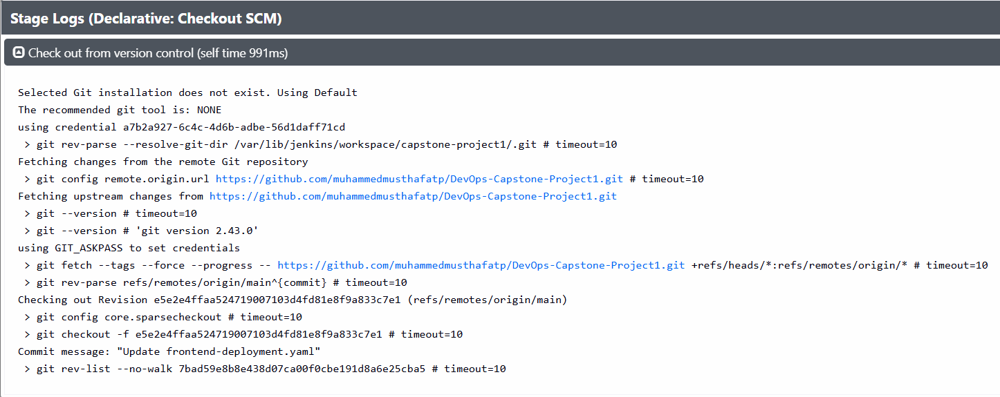 | 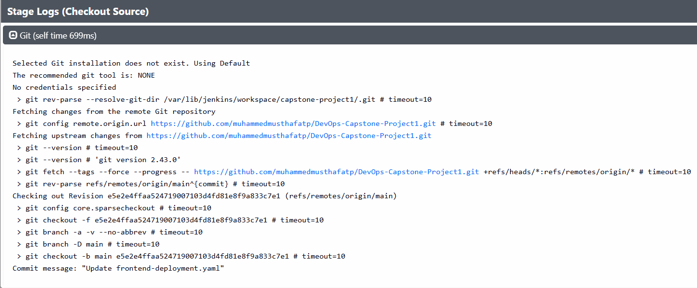 |

Jenkins pulls directly from the [DevOps-Capstone-Project1](https://github.com/muhammedmusthafatp/DevOps-Capstone-Project1) repository and checks out the exact commit that triggered the build.

### Code Quality Analysis

| SonarQube Analysis | Quality Gate |
|---|---|
| 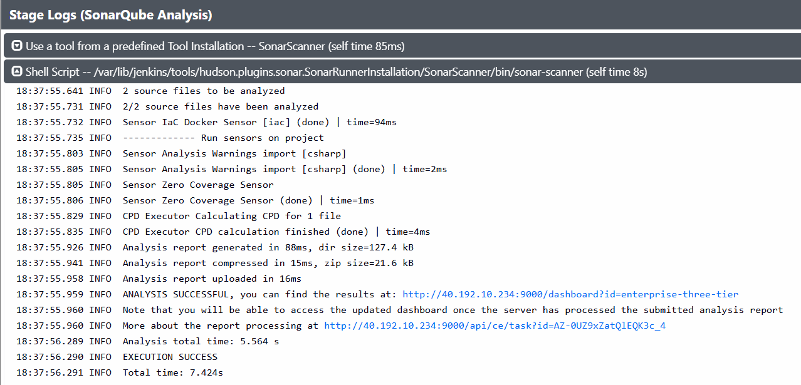 | 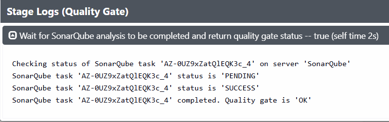 |

<div align="center">
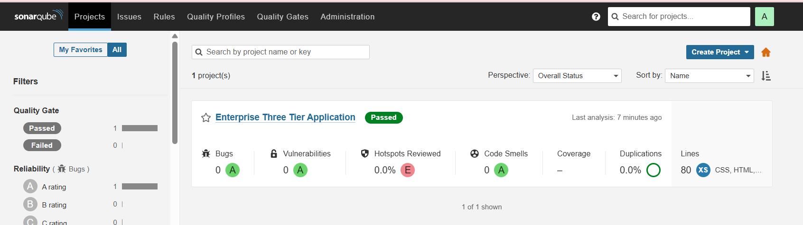
</div>

Every build is scanned for bugs, code smells, and security hotspots before a single Docker image gets built — code that doesn't pass the Quality Gate never reaches production.

### Docker Image Build

| Backend Image | Frontend Image |
|---|---|
| 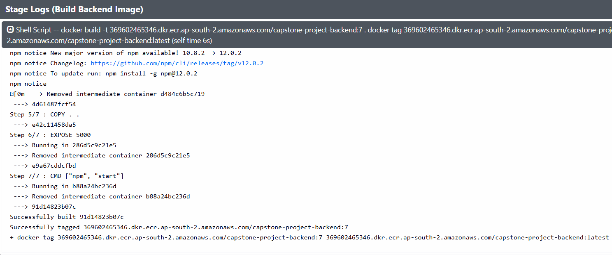 | 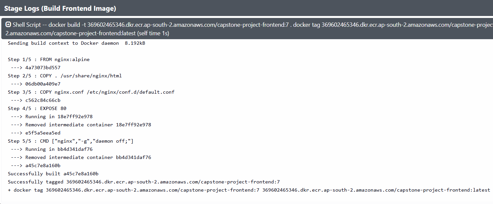 |

Both images are built and tagged twice — once with the Jenkins **build number** (e.g. `7`) for traceability, and once as **`latest`** for convenience.

### Authenticate & Push to Amazon ECR

<div align="center">
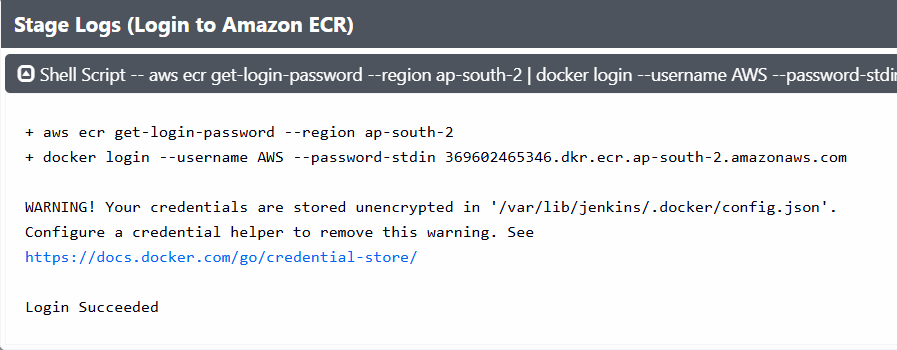
</div>

| Push Backend Image | Push Frontend Image |
|---|---|
| 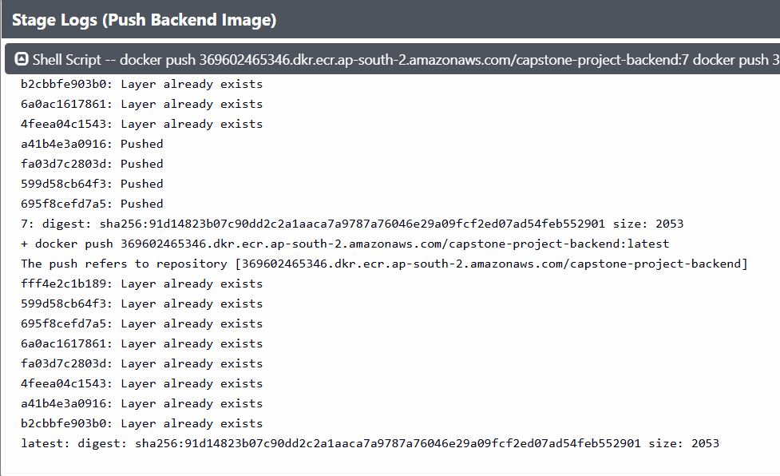 | 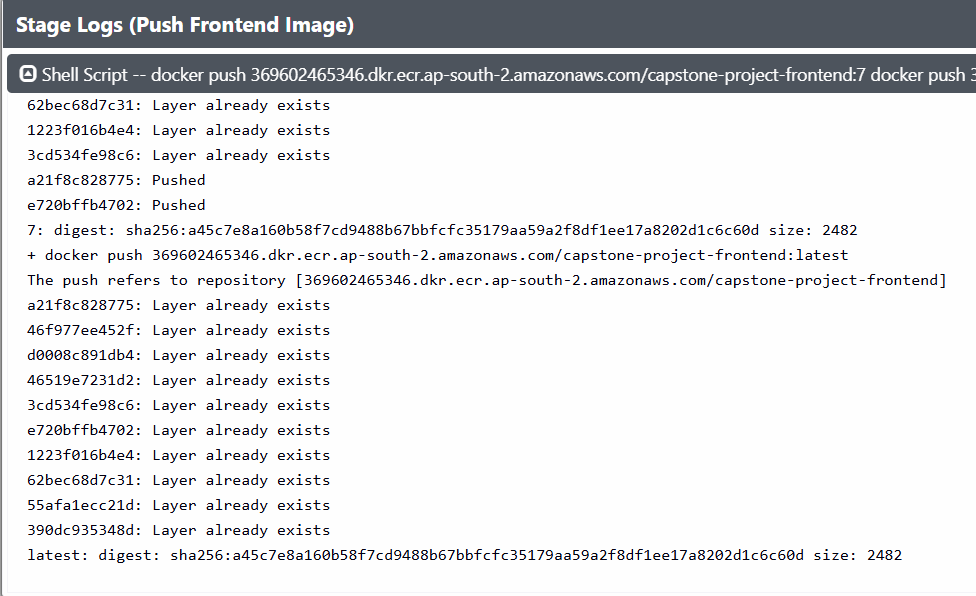 |

Jenkins authenticates to Amazon ECR using short-lived credentials via `aws ecr get-login-password`, then pushes both the versioned and `latest` tags.

### ECR Repositories

| `capstone-project-backend` | `capstone-project-frontend` |
|---|---|
| 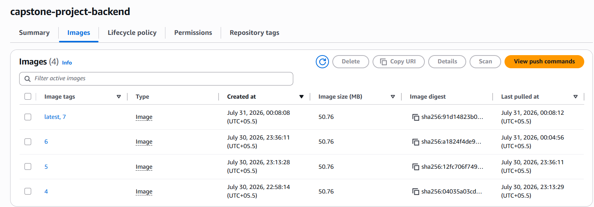 | 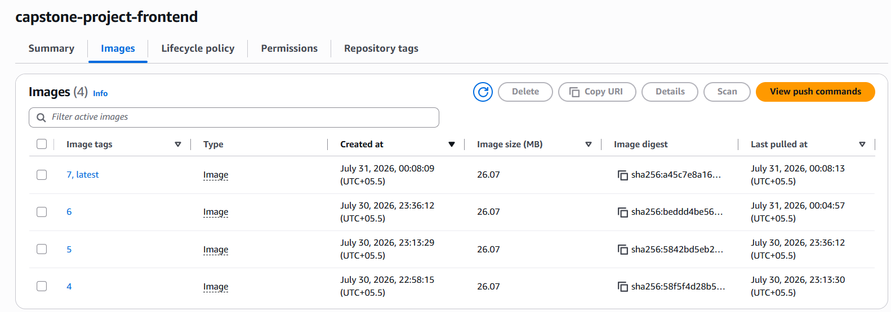 |

Every pipeline run produces a new, immutable image version — giving a full audit trail and instant rollback capability.

### Deploy to Kubernetes

<div align="center">
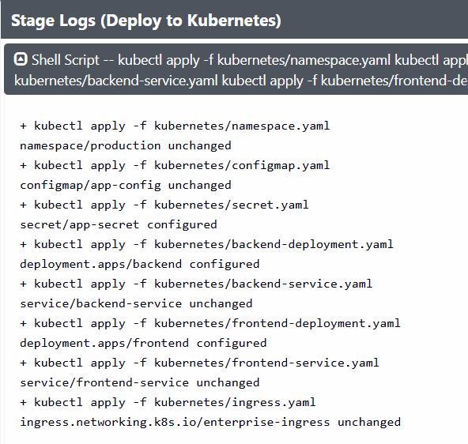
</div>

The pipeline applies the namespace, ConfigMap, Secret, Deployments, Services, and Ingress manifests declaratively with `kubectl apply -f`.

### Update Manifest & Verify Rollout

| Update Image Tag | Verify Rollout |
|---|---|
| 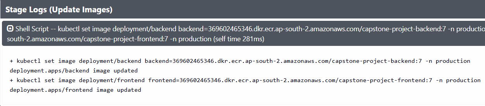 | 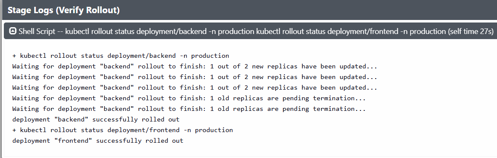 |

The deployment manifest is updated with the newly built image tag, and Kubernetes performs a rolling update — replacing old Pods with new ones gradually, with `kubectl rollout status` confirming a clean, healthy rollout.

### Full Pipeline Stage View

<div align="center">
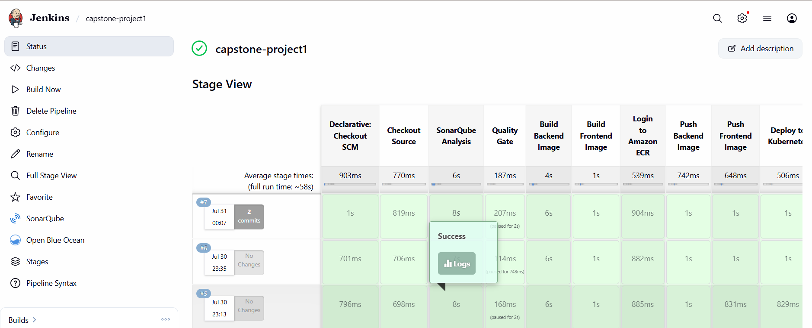
</div>

Every stage — checkout, code quality, build, push, deploy, verify — executes green, end to end, on every commit.

### Pipeline Result

<div align="center">
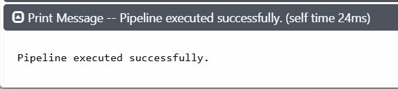
</div>

---

## ☸️ Kubernetes Resources

| Resource | Purpose |
|---|---|
| **Namespace** | Isolates the application from other workloads |
| **Deployment** | Manages Pod replicas and rollout strategy |
| **ReplicaSet** | Ensures high availability of Pods |
| **Service** | Provides stable internal networking |
| **ConfigMap** | Externalizes non-sensitive configuration |
| **Secret** | Stores sensitive credentials securely |
| **Ingress** | Exposes the application externally via NGINX |

<div align="center">
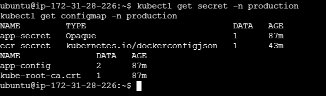
</div>

---

## ✅ Cluster Verification

After deployment, the cluster is verified end-to-end — pods running, services routing, and ingress exposing traffic:

| Deployments | Pods |
|---|---|
| 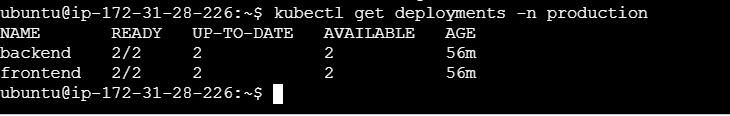 | 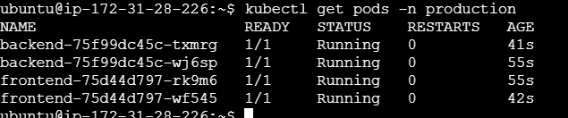 |

| Services | Ingress |
|---|---|
| 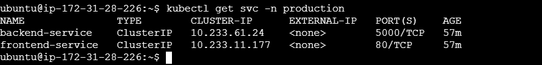 | 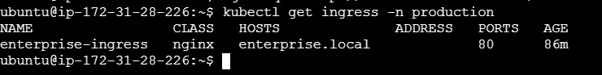 |

Both `backend` and `frontend` deployments report **2/2 replicas ready and available**, confirming a healthy, highly available rollout.

---

## 🚀 Key Features

- ✅ Fully automated, webhook-triggered CI/CD
- ✅ Static code analysis with SonarQube Quality Gates
- ✅ Immutable, versioned Docker image builds
- ✅ Secure image storage in Amazon ECR
- ✅ Declarative Kubernetes deployments
- ✅ ConfigMaps & Secrets for clean configuration management
- ✅ Rolling updates with **zero downtime**
- ✅ Readiness & Liveness probes for self-healing Pods
- ✅ High availability via multi-replica Deployments
- ✅ NGINX Ingress for external access

---

## ⚠️ Challenges & Solutions

| Challenge | Resolution |
|---|---|
| Jenkins authentication failures | Configured Jenkins credentials store and IAM permissions correctly |
| Jenkins ↔ Kubernetes connectivity | Set up and mounted `kubeconfig` for cluster access from Jenkins |
| SonarQube integration | Installed the scanner plugin and configured Quality Gate webhooks |
| Amazon ECR authentication | Configured IAM roles and Docker registry login via `aws ecr get-login-password` |
| `ImagePullBackOff` / `InvalidImageName` | Corrected image URIs and added an ECR image pull secret |
| Readiness probe failures | Tuned probe timing to match actual application startup |
| Ingress not routing | Deployed and configured the NGINX Ingress Controller |

---

## 💼 Skills Demonstrated

`AWS` · `Linux Administration` · `Docker` · `Kubernetes` · `Kubespray` · `Jenkins` · `GitHub` · `SonarQube` · `Amazon ECR` · `CI/CD Automation` · `Infrastructure Automation` · `Rolling Deployments` · `Kubernetes Networking` · `Production Debugging`

---

## 👨‍💻 Author

**Muhammed Musthafa T P**
*DevOps Engineer | Cloud Enthusiast | AWS · Docker · Kubernetes · Jenkins*

[](https://github.com/muhammedmusthafatp)

<div align="center">

⭐ *If this project helped you understand CI/CD on Kubernetes, consider giving it a star!* ⭐

</div>
